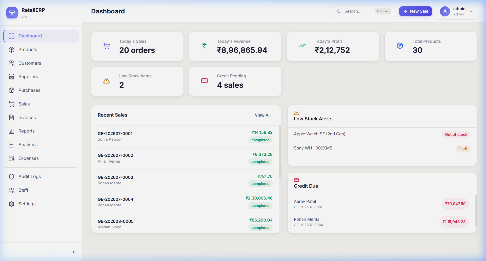

# RetailERP-Pro

> **Complete GST Billing, Inventory, Customer & Sales Management System for Indian SMEs**




---

## Overview

RetailERP-Pro is a production-ready, full-stack ERP solution built for Indian retail shops, electronics stores, and small businesses. It handles everything from daily point-of-sale billing with GST tax calculations, to inventory management, purchase tracking, expense logging, and detailed business analytics — all through a clean, modern web interface.

The system auto-seeds with realistic demo data on first boot, so you can explore every feature right away.

---

## Key Features

### Billing & Sales
- **Point-of-Sale (POS)** — Fast checkout interface with barcode scanning, real-time stock validation, and multi-item invoicing
- **GST Tax Engine** — Automatic CGST/SGST (intra-state) or IGST (inter-state) calculation based on customer location, supporting all GST slabs (0%, 5%, 12%, 18%, 28%)
- **Payment Tracking** — Support for Cash, UPI, Card, and Credit payments with due date tracking
- **Credit Management** — Track outstanding balances, record partial payments, and view customer-wise credit history

### Inventory & Products
- **Product Catalog** — Full product management with categories, brands, HSN codes, barcodes, purchase/selling prices, and stock levels
- **Stock Ledger** — Every stock movement (purchase, sale, return, manual adjustment) is recorded with running balance
- **Low Stock Alerts** — Dashboard warnings when any product drops below configured minimum stock
- **Category Management** — Organize products into logical groups

### Purchase & Supplier Management
- **Purchase Orders** — Record stock purchases from suppliers with line items, tax, and payment status
- **Supplier Directory** — Maintain supplier contacts, GSTIN, and state for tax determination
- **Purchase History** — Track all inbound stock with supplier invoices

### Customers & Accounts
- **Customer Database** — Store customer details, GSTIN, state, and contact information
- **Customer Ledger** — Double-entry style ledger with sale debits, payment credits, and running balances
- **Accounts Receivable** — View all pending credit sales at a glance from the dashboard

### Invoicing
- **PDF Invoice Generation** — Auto-generated professional A4 invoices with GST breakdowns, payment QR codes, and shop branding
- **Invoice History** — Browse and re-download any previously generated invoice

### Analytics & Reports
- **Business Analytics** — Revenue trends, top-selling products, top customers, category-wise breakdown, and payment method distribution
- **Sales Reports** — Date-range filtered reports with totals, tax summaries, and profit calculations
- **Expense Tracking** — Log business expenses across categories (Rent, Salary, Utilities, Transport, etc.) with monthly summaries

### Security & Audit
- **Role-Based Access** — Admin and Staff roles with JWT authentication
- **Immutable Audit Trail** — Every data mutation (create, update, delete) is logged with before/after snapshots
- **Staff Management** — Create/deactivate staff accounts with forced password change on first login

### Settings
- **Shop Configuration** — Set shop name, address, phone, email, GSTIN, state, and invoice prefix
- **Database Backup** — Export and import database backups from the admin panel

---

## Demo

### Dashboard Walkthrough


The demo shows the dashboard with seeded data, navigating through Products, Customers, Sales, and Analytics pages.

---

## Technology Stack

| Component | Technologies |
|:------|:-----------|
| **Frontend UI** | React 19, Tailwind CSS 4, Recharts, Lucide Icons |
| **Backend API** | FastAPI, SQLAlchemy, Pydantic |
| **Authentication** | JWT (python-jose), bcrypt password hashing |
| **Database** | SQLite (dev), PostgreSQL via Neon (production) |
| **Document Generation** | ReportLab, qrcode |
| **Infrastructure** | Docker, Docker Compose, Nginx |
| **Deployment** | Vercel (frontend), Render (backend) |

---

## Quick Start

### Docker (Recommended)

```bash
# Clone the repository
git clone https://github.com/GskCoder/RetailERP-Pro.git
cd RetailERP-Pro

# Start the application
docker compose up -d --build
```

Access the app:
- **Frontend:** `http://localhost`
- **API Docs:** `http://localhost:8000/docs`

```bash
# Stop the application
docker compose down
```

### Local Development

**Prerequisites:** Python 3.11+, Node.js 20+

**Backend:**
```bash
cd backend
python -m venv venv

# Activate virtual environment
venv\Scripts\activate      # Windows
# source venv/bin/activate  # Linux/macOS

pip install -r requirements.txt
uvicorn app.main:app --reload
```

**Frontend:**
```bash
cd frontend
npm install
npm run dev
```

The backend auto-seeds with demo data on first run. No manual setup needed.

---

## Default Credentials

| Username | Password | Role |
|:---------|:---------|:-----|
| `admin` | `admin123` | Administrator |

---

## Data Seeding

The system comes with a comprehensive seed script that populates all modules on first boot:

- **30 products** across 8 categories (phones, audio, accessories, etc.)
- **5 suppliers** with Indian addresses and GSTINs
- **10 customers** across multiple Indian states
- **20 sales** with mixed payment methods and GST calculations
- **8 purchase orders** from suppliers
- **15 expenses** across categories (rent, salary, utilities, etc.)
- **Audit logs** for all operations

To re-seed, delete `backend/retailerp.db` and restart the backend.

---

## Project Structure

```text
RetailERP-Pro/
├── backend/
│   ├── app/
│   │   ├── core/           # Config, database, security, dependencies
│   │   ├── auth/           # JWT authentication & user management
│   │   ├── settings/       # Shop configuration (singleton)
│   │   ├── audit/          # Immutable mutation logging
│   │   ├── products/       # Product catalog & categories
│   │   ├── customers/      # Customer CRM & ledger
│   │   ├── inventory/      # Stock ledger & transactions
│   │   ├── sales/          # POS, invoicing, GST computation
│   │   ├── invoices/       # PDF generation
│   │   ├── suppliers/      # Supplier management
│   │   ├── purchases/      # Purchase order tracking
│   │   ├── expenses/       # Expense tracking & categories
│   │   ├── reports/        # Sales & financial reports
│   │   ├── analytics/      # Business intelligence & charts
│   │   ├── backup/         # Database export/import
│   │   └── search/         # Global search across entities
│   ├── seed.py             # Comprehensive demo data seeder
│   ├── requirements.txt
│   └── Dockerfile
├── frontend/
│   ├── src/
│   │   ├── components/     # Reusable UI components
│   │   ├── pages/          # Route-level page components
│   │   ├── context/        # React context (auth, theme)
│   │   ├── utils/          # Formatting & helper utilities
│   │   └── api/            # Axios HTTP client
│   ├── nginx.conf
│   └── Dockerfile
├── docs/                   # Screenshots & demo assets
├── docker-compose.yml
└── render.yaml             # Render deployment blueprint
```

---

## Environment Variables

Copy `backend/.env.example` to `backend/.env` and configure:

```env
# Database (SQLite for dev, PostgreSQL for production)
DATABASE_URL=sqlite:///./retailerp.db

# JWT Secret (use a strong random key in production)
SECRET_KEY=change-me-to-a-real-secret-key

# Frontend URL for CORS
FRONTEND_URL=http://localhost:5173
```

---

## License

This project is open source and available under the [MIT License](LICENSE).
